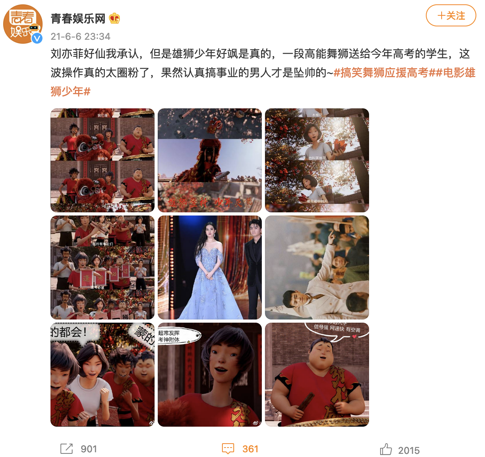
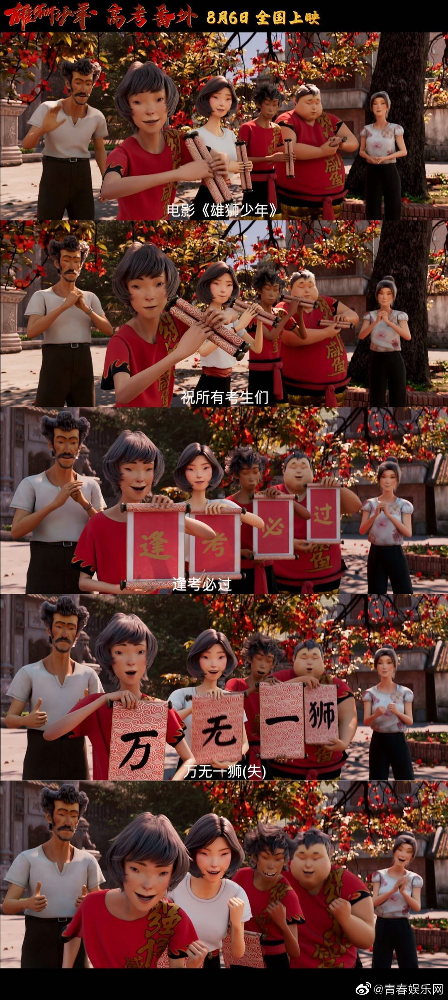
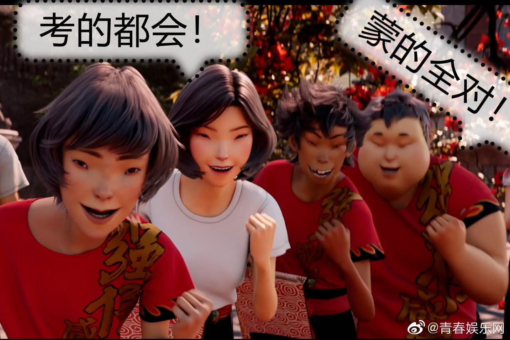
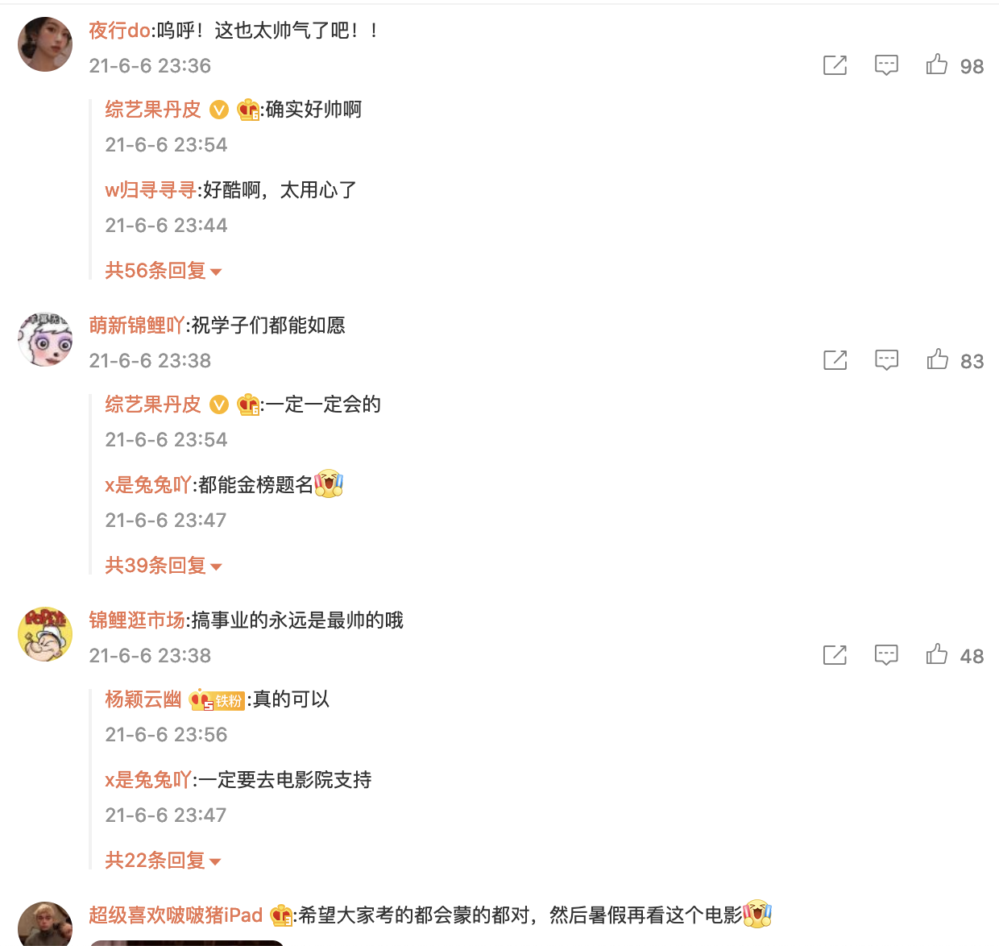
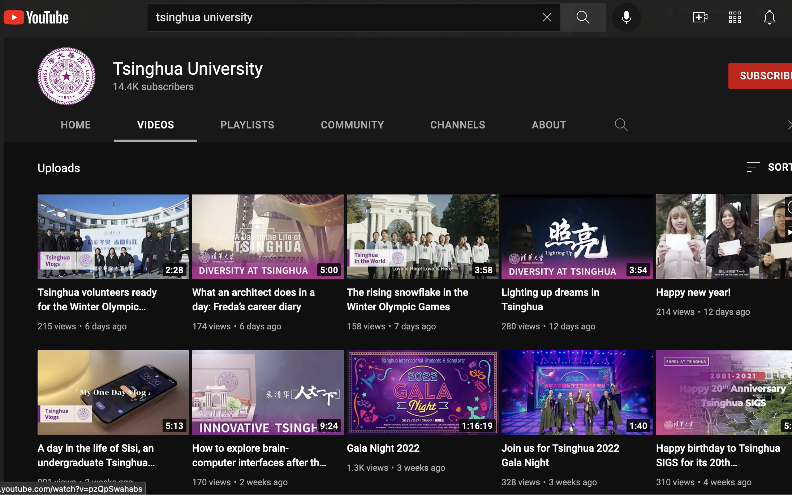
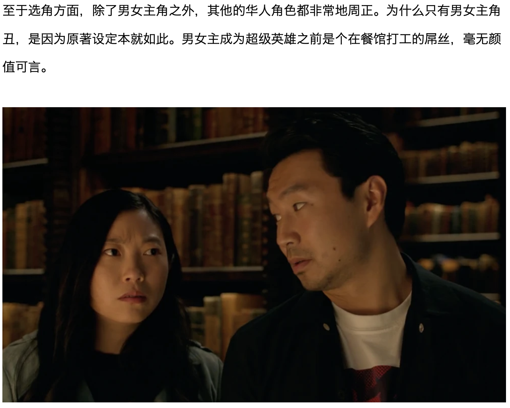

# 雄狮少年

以下为2021年六月之后的舆情时间线，
请各位补充遗漏。
## 2021年六月
### 7日

7:44，发布主角海报，仍写着 8月6日上映：

同日 8:30，《雄狮》微博号发布高考加油视频。

最早在半小时后就有评论提到“刻板印象”：

[此微博](https://weibo.com/1269870303/Kj4E8lg7Q) （由于时差，本人所截图中微博的时间戳可能有偏差）发布一系列高考加油视频截图“一段高能舞狮送给今年高考的学生”：

其中的一联的最后一图中的局部与后来广为流传的四人主角团大头照相符：

包括有加油旁白框的此图：

此微博下数百条评论，没看到有关人物造型的：

### 15日

某号在油管发布清华美院视频【找不到原视频】。当晚，“眯眯眼”微博引发争议：

之后有学生辟谣：

知乎某高赞文章中的清华视频缩略图如下：

然而油管的清华官方账号为全英文，而且全部视频也都是全英文题目：

再看上面的简介中“这里是清华大学，欢迎订阅。Welcome to subscribe Tsinghua University！”，用语非常不自然。现在无法找到该账号。有冒名账号的可能。
### 29日

影片宣布改档，将于2021年贺岁档上映

## 2021年九月

### 三日

《尚气》在北美上映。两年前曾因梁朝伟出演与男女主角相貌引发抵制风潮，在当时甚至还未得知剧情的情况下。

### 十三日

[自媒体发文](https://www.sohu.com/a/489659727_100193305) 反思当年的抵制风潮。后有 [文章](https://new.qq.com/omn/20211113/20211113A08RLX00.html) 提到主角选角与剧情相符：

即便如此，电影上映后在知乎的 [相关问题](https://www.zhihu.com/question/485027452) 下，高赞几乎无一个讨论剧情，仍然围绕着原本的“刻板印象”。

这方面看，与后来《雄狮》被攻击的方式、结果都相似。

## 2021年十月

### 9日

某微博下有评论提到眼距：

查证微博原评论如下：

点链接可见广为流传的图：

从图片特征基本看很可能源自6月7日夜自媒体微博所发图片。从多个水印看，已为某（几）位博主处理过，具体时间不明。

### 22日

该片发布“破云”版国风定档海报，宣布于12月17日上映：

### 30日

发布“崛起”版训练预告
## 2021年十一月

### 14日

陈漫的以往作品引发争议，以下图片被“精选”后流传：

### 17日

《雄狮》发布“靓仔出街”版人物预告，微博评论区出现批评造型：

点开其中一人，下一条是关于陈漫：

### 22日

发布“接招”版人物海报，其中有被之后传为原画的两幅：

## 十二月

### 2日

该片在广州举行路演活动

### 3日

该片在深圳举办了路演

### 5日

该片在武汉举行映后见面会

### 6日

该片在郑州进行路演

### 10日

该片在重庆英皇电影城举行路演，以及国家版权局公布2021年度第十五批重点作品版权保护预警名单

### 11日

该片发布“为自己而战”终极预告

### 14日

发布终极海报，也被网传为原画：

[张苗](https://weibo.com/tv/show/1042211:4714386644992155?from=old_pc_videoshow) 在线上直播接受采访时提到“***每个主创***拿起镜子看一看自己”。（44分10秒左右）

### 17日

《雄狮少年》正式上映。

10：31 新京报文中提到“***大家***拿出镜子或者手机”：

而新京报微博中，不仅张苗的话被截断（结尾在“不一定能够成功”），而且将张苗的话“自己非常清楚将角色做得帅气会更安全、也很简单，但我们需要做出对不同审美的探索，尽管不一定能够成功”说成了导演张海鹏的：

微博中的长图开头醒目位置也将张苗的话说成了张海鹏的：

此条微博到2022年1月12日，被转发数千次：

【以下时间线尚不明】

网传“导演说中国人/广东人都长这样”：

【待找高赞截图】

并传有采访图如下：

后被发现是在豆瓣电影上导演孙海鹏的的照片上P上的文字：

## 参考资料

- 6月7日 [电影《雄狮少年》曝人物海报 喜剧天团助力爆笑解压](http://ent.ynet.com/2021/06/07/3311632t1254.html)
- 6月17日 [清华美院毕设满屏「眯眯眼」：自己都瞧不起自己，还有脸搞时尚？](https://zhuanlan.zhihu.com/p/381787394)
- 6月18日 [因为眯眯眼，清华大学再次处于风口浪尖！](https://zhuanlan.zhihu.com/p/381880023)
- [清华美院学生辟谣“眯眯眼”事件！选模特的时候，什么类型都有](https://new.qq.com/omn/20211008/20211008A04L7A00.html)
- 11月17日 [又一名人涉嫌辱华？陈漫作品疑贬低女性，“眯眯眼”造型丑到生气](https://new.qq.com/omn/20211117/20211117A0BE8M00.html)
- 11月22日 [电影《雄狮少年》曝“接招”版人物海报 水墨风唤醒“武侠”热血](http://ent.ynet.com/2021/11/22/3391186t1254.html)
- 12月14日 [国漫《雄狮少年》曝终极海报 将推出全粤语版本](https://cj.sina.com.cn/articles/view/1635270132/61783df4020014hfl)
- 12月17日 新京报 [动画脸同质化，《雄狮少年》“眯眯眼”要展现审美自信丨揭秘](https://baijiahao.baidu.com/s?id=1719358768803340461&wfr=spider&for=pc&searchword=%E5%8A%A8%E7%94%BB%E8%84%B8%E6%98%AF%E5%90%8C%E8%B4%A8%E5%8C%96)
- [《尚气》票房破2.5亿美金！国内观众还在为“是否辱华”争吵不休 ](https://www.sohu.com/a/489659727_100193305)
- [理性讨论，电影《尚气》到底有没有辱华？](https://new.qq.com/omn/20211113/20211113A08RLX00.html)
- [知乎回答：《雄狮少年》，如何评价这部动画电影呢？](https://www.zhihu.com/question/505996203/answer/2285801323)
- [知乎回答：关于电影《雄狮少年》，到底有没有水军在洗地？](https://www.zhihu.com/question/505491473/answer/2300956736)
- [百度百科：雄狮少年](https://baike.baidu.com/item/%E9%9B%84%E7%8B%AE%E5%B0%91%E5%B9%B4/54165487?fr=aladdin)
