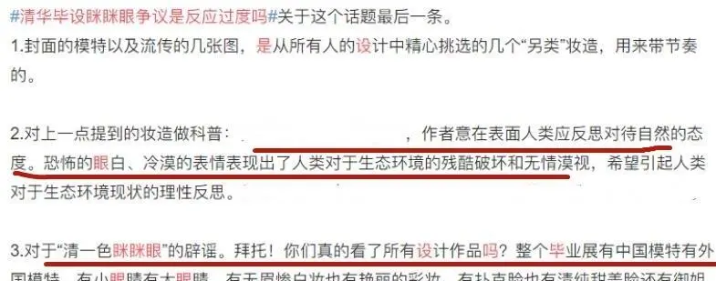
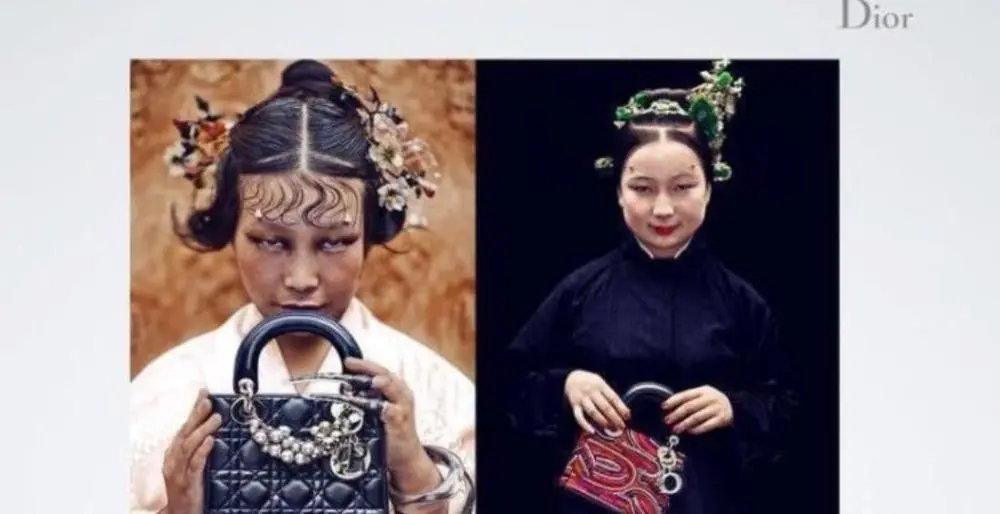

# 雄狮少年

以下为2021年六月之后的舆情时间线，
请各位补充遗漏。
## 2021年六月

### 7日

7:44，发布主角海报，仍写着 8月6日上映：

同日 8:30，《雄狮》微博号发布高考加油视频。

最早在半小时后就有评论提到“刻板印象”：

### 15日

某号在油管发布清华美院视频【找不到原视频】。当晚，“眯眯眼”微博引发争议：

之后有学生辟谣：

知乎某高赞文章中的清华视频缩略图如下：

然而油管的清华官方账号为全英文，而且全部视频也都是全英文题目：

再看上面的简介中“这里是清华大学，欢迎订阅。Welcome to subscribe Tsinghua University！”，用语非常不自然。现在无法找到该账号。有冒名账号的可能。
### 29日

影片宣布改档，将于2021年贺岁档上映

## 2021年十月

### 9日

有微博评论眼距：

查证微博原评论如下：

点链接可见广为流传的图：

从原始微博视频上很难截得如此清晰的图，或许从其他途径获得。这是至今找到的最早图，但从图片已有多个水印看，此图应为转载。

### 22日

该片发布“破云”版国风定档海报，宣布于12月17日上映：

### 30日

发布“崛起”版训练预告
## 2021年十一月

### 14日

陈漫的以往作品引发争议，以下图片被“精选”后流传：

### 17日

该片发布“靓仔出街”版人物预告

### 22日

发布“接招”版人物海报，其中有被之后传为原画的两幅：

## 十二月

### 2日

该片在广州举行路演活动

### 3日

该片在深圳举办了路演

### 5日

该片在武汉举行映后见面会

### 6日

该片在郑州进行路演

### 10日

该片在重庆英皇电影城举行路演，以及国家版权局公布2021年度第十五批重点作品版权保护预警名单

### 11日

该片发布“为自己而战”终极预告

### 14日

发布终极海报，也被网传为原画：

[张苗](https://weibo.com/tv/show/1042211:4714386644992155?from=old_pc_videoshow) 在线上直播接受采访时提到“***每个主创***拿起镜子看一看自己”。（44分10秒左右）

### 17日

《雄狮少年》正式上映。

新京报文章中提到“***大家***拿出镜子或者手机”。

## 参考资料

- 6月7日 [电影《雄狮少年》曝人物海报 喜剧天团助力爆笑解压](http://ent.ynet.com/2021/06/07/3311632t1254.html)
- 6月17日 [清华美院毕设满屏「眯眯眼」：自己都瞧不起自己，还有脸搞时尚？](https://zhuanlan.zhihu.com/p/381787394)
- 6月18日 [因为眯眯眼，清华大学再次处于风口浪尖！](https://zhuanlan.zhihu.com/p/381880023)
- [清华美院学生辟谣“眯眯眼”事件！选模特的时候，什么类型都有](https://new.qq.com/omn/20211008/20211008A04L7A00.html)
- 11月17日 [又一名人涉嫌辱华？陈漫作品疑贬低女性，“眯眯眼”造型丑到生气](https://new.qq.com/omn/20211117/20211117A0BE8M00.html)
- 11月22日 [电影《雄狮少年》曝“接招”版人物海报 水墨风唤醒“武侠”热血](http://ent.ynet.com/2021/11/22/3391186t1254.html)
- 12月14日 [国漫《雄狮少年》曝终极海报 将推出全粤语版本](https://cj.sina.com.cn/articles/view/1635270132/61783df4020014hfl)
- 12月17日 新京报 [动画脸同质化，《雄狮少年》“眯眯眼”要展现审美自信丨揭秘](https://baijiahao.baidu.com/s?id=1719358768803340461&wfr=spider&for=pc&searchword=%E5%8A%A8%E7%94%BB%E8%84%B8%E6%98%AF%E5%90%8C%E8%B4%A8%E5%8C%96)
- [知乎回答：《雄狮少年》，如何评价这部动画电影呢？](https://www.zhihu.com/question/505996203/answer/2285801323)
- [知乎回答：关于电影《雄狮少年》，到底有没有水军在洗地？](https://www.zhihu.com/question/505491473/answer/2300956736)
- [百度百科：雄狮少年](https://baike.baidu.com/item/%E9%9B%84%E7%8B%AE%E5%B0%91%E5%B9%B4/54165487?fr=aladdin)
