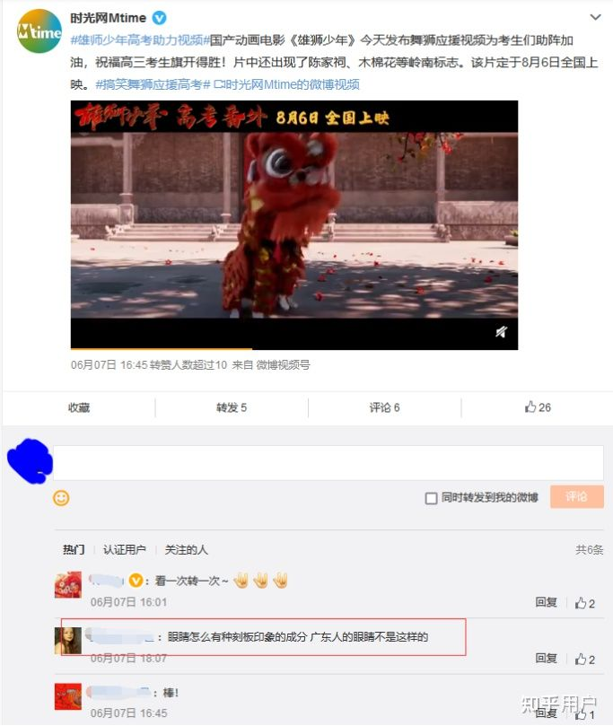
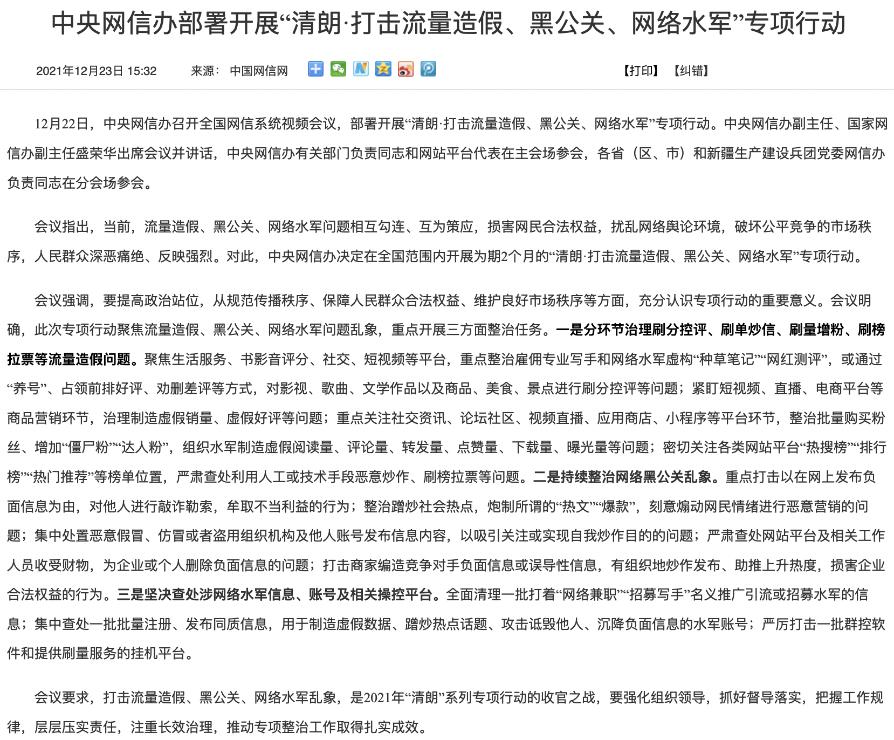
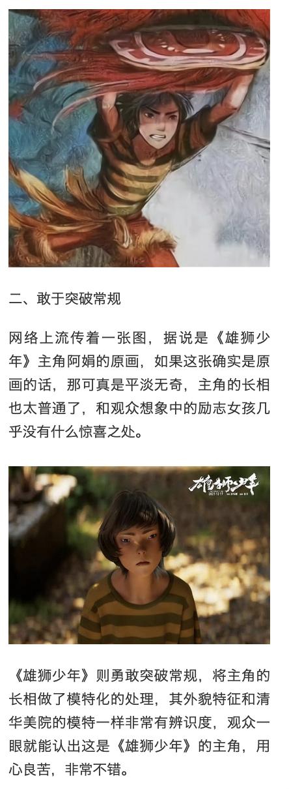
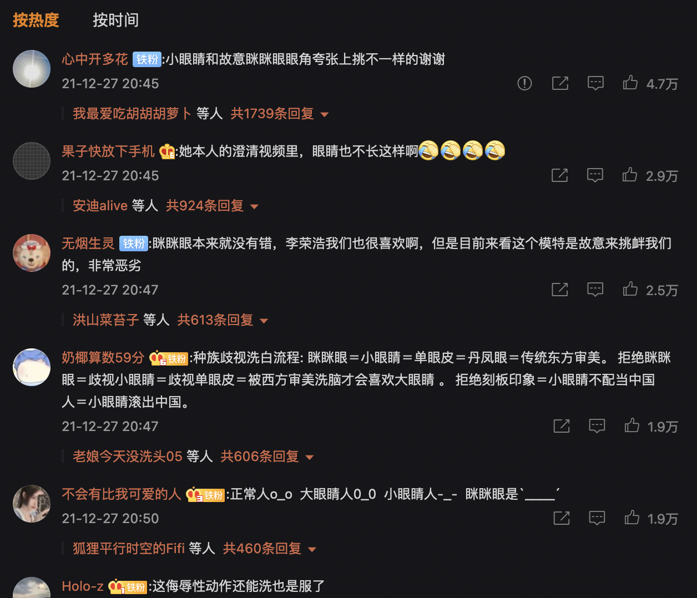

> 以史为鉴。

> 极简版：番外篇>清华美院毕设>陈漫>正式上映>三只松鼠、奔驰广告。

# 雄狮少年

以下为2021年六月之后的舆情时间线，
请各位补充遗漏。
## 2021年六月
### 7日

#### 发布主角海报和高考加油视频

7:44，发布主角海报，写着 8月6日上映：

同日 8:30，《雄狮》微博号发布高考加油视频。

最早在半小时后就有评论提到“刻板印象”：

[此微博](https://weibo.com/1269870303/Kj4E8lg7Q) （由于时差，本人所截图中微博的时间戳可能有偏差）发布一系列高考加油视频截图“一段高能舞狮送给今年高考的学生”：

其中此联的最后一图中的局部与后来广为流传的四人主角团大头照相符：

还有加油旁白框的此图：

此微博下数百条评论，没看到有关人物造型的：

#### 蒋方舟回应争议

7日中午，蒋方舟发微博回应 2017年写作《东京一年》前的访日经历：

后有更多对蒋方舟以往言论的追究，如司马南14日的《五论蒋方舟现象，局部的真实与本质的狰狞》：

### 15日

零、北京精彩发布“中国少年宇宙”规划

15日，北京精彩时间文化传媒有限公司（下简称：北京精彩）于上海电影节期间公布2021年片单（[海报全图在此](图/2021_06_15_规划.jpeg)）：

一、清华美院毕设事件

当晚，“眯眯眼”微博引发争议：

之后有学生辟谣：

现已找不到油管原视频，知乎某高赞文章中的清华视频缩略图如下：

然而油管的清华官方账号为全英文，而且全部视频也都是全英文题目：

再看上面的简介中“这里是清华大学，欢迎订阅。Welcome to subscribe Tsinghua University！”，用语非常不自然。现在无法找到该账号。有冒名账号的可能。

二、《钢之炼金术师》作者荒川弘事件

同一天，该作者十年前的作品《雷电十八号》爆出有辱华情节，并引发知乎热议 [如何看待漫画《钢之炼金术师》作者塌房？](https://www.zhihu.com/question/465127240)：

### 29日

影片宣布改档，将于2021年贺岁档上映

## 2021年七月

### 三日

B站美妆UP主 @机智的党妹 因所发视频中1分15秒至1分44秒处“穿着洛丽塔裙在旅顺博物馆门口跳宅舞”引发争议后删视频道歉。两天后新华短评：

一个月后该UP主 [退网](https://zhuanlan.zhihu.com/p/398268108)。

## 2021年九月

### 三日

《尚气》在北美上映。两年前，在还未得知剧情的情况下，网上因梁朝伟出演与男女主角相貌等引发抵制风潮。

### 十三日

[自媒体发文](https://www.sohu.com/a/489659727_100193305) 反思当年的抵制风潮。后有 [文章](https://new.qq.com/omn/20211113/20211113A08RLX00.html) 提到主角选角与剧情相符：

即便如此，电影上映后在知乎的 [相关问题](https://www.zhihu.com/question/485027452) 下，高赞几乎无一讨论剧情，仍然围绕着原本的“刻板印象”。

这方面看，与后来《雄狮》被攻击的方式、结果都相似。

### 二十四日

B站视频 [12分钟看完《钢之炼金术师》作者”牛姨“荒川弘辱华事件始末](https://www.bilibili.com/video/BV18q4y1o7QW) 重提六月事件。

## 2021年十月

### 9日

此微博下有评论提到眼距：

查证微博原评论如下：

点链接可见广为流传的图：

从图片特征看很可能源自6月7日夜自媒体微博所发图片。从多个水印看，已为某（几）位博主处理过，具体时间不明。

### 22日

该片发布“破云”版国风定档海报，宣布于12月17日上映：

### 30日

发布“崛起”版训练预告
## 2021年十一月

### 14日

陈漫的以往作品引发争议，以下图片被“精选”后流传：

### 17日

《雄狮》发布“靓仔出街”版人物预告，微博评论区出现批评造型：

点开其中一人，下一条是关于陈漫：

### 22日

发布“接招”版人物海报，其中有被之后传为原画的两幅：

## 十二月

### 2日

该片在广州举行路演活动

### 3日

该片在深圳举办了路演

### 5日

该片在武汉举行映后见面会

### 6日

该片在郑州进行路演

### 10日

该片在重庆英皇电影城举行路演，以及国家版权局公布2021年度第十五批重点作品版权保护预警名单

### 11日

该片发布“为自己而战”终极预告

### 14日

发布终极海报，也被网传为原画：

[张苗](https://weibo.com/tv/show/1042211:4714386644992155?from=old_pc_videoshow) 在线上直播接受采访时提到“***每个主创***拿起镜子看一看自己”。（44分10秒左右）

### 17日

《雄狮少年》正式上映。

周五排片为8.6万场次：

#### 新京报文章和微博

10：31 新京报文中提到“***大家***拿出镜子或者手机”：

而新京报微博中，不仅张苗的话被截断（结尾在“不一定能够成功”），而且将张苗的话“自己非常清楚将角色做得帅气会更安全、也很简单，但我们需要做出对不同审美的探索，尽管不一定能够成功”说成了导演张海鹏的：

微博中的长图开头醒目位置也将张苗的话说成了张海鹏的：

此条微博到2022年1月12日，被转发数千次：

### 二十一日

央视新闻（CCTV 13）评雄狮少年是文化自信：

### 二十二日

[中央网信办部署开展“清朗·打击流量造假、黑公关、网络水军”专项行动](http://www.cac.gov.cn/2021-12/23/c_1641859284732677.htm)：

## 二十五日

### 三只松鼠广告
根据 [胡锡进微博](https://weibo.com/1989660417/L8fzecHKN)，三只松鼠广告事件已开始发酵：

### 奔驰广告

中午，奔驰微博发布广告（后删）：

### 二十六日

周日排片为6万场次，比周六高一成：

但相比周六的票房下降比前个周末明显的多：

#### 某自媒体文章

自媒体文章提到“法国昂西电影节还将《雄狮少年》的几个主角阿娟、阿猫、阿狗主推作为东方人物形象的典范”（此句 [三天后被指出为子虚乌有](https://m.thepaper.cn/baijiahao_16048146)）：

同一篇文章中，提到电影改动档期“和清华美院模特有关”：

此文中，还使用了流传的“原画”（实际上是海报局部，见前），并指“将主角的长相做了模特化的处理，其外貌特征和清华美院的模特一样非常有辨识度”：

“按照《雄狮少年》制片人张苗的说法，他们在广东等地进行了多次采风，而且他还建议大家拿出手机将滤镜关掉，好好看看自己，再想想身边人的相貌……”：

其他的部分也写的非常有水平和指向性，强烈建议阅读[原文](https://c.m.163.com/news/a/GS5A0BEQ05376S8M.html)（存档 [在此](图/2021_12_26_抛开画面、人物和形象不谈，《雄狮少年》还是很不错的.pdf)）。

#### “三只松鼠”上热搜

同为 26日，2019年的“三只松鼠”广告上热搜：

未找到网友扒出此图的具体时间：

中午三只松鼠官方微博道歉：

### 二十七日

“三只松鼠”广告模特 [微博发言](https://weibo.com/2366392710/L7RJl1ErQ) ：

引发对模特以往视频截图的争议。

#### 共青团中央

同日，共青团中央发微博 [如何看待宣传作品中眯眯眼争议](https://weibo.com/3937348351/L88sjzzlt) 获近八万赞：

评论区中有高赞用《雄狮少年》番外篇局部截图：

### 人民日报

同日，人民日报微博发文 [怎样看待围绕“眯眯眼”的争议](https://www.weibo.com/2803301701/L87EAap8N)，用三只松鼠开头、配图，顺带《雄狮》。获赞四十多万：

正文开头：“充分尊重受众，才能赢得市场”：

后文仅粉丝可见：

最后部分才是“坚持效果导向，也避免扣帽子”

从微博评论区高赞看来，几乎无一看完文章：

### 二十八日

共青团中央发知乎长文 [“眯眯眼”事件还在发酵，其实比眼梢更上挑的，是所谓的“东方主义”……](https://zhuanlan.zhihu.com/p/451125294)，引用图有傅满洲、国外名人拉眼角动作、尚气女主角、D&G广告、陈漫作品、三只松鼠模特视频截图、李小龙访谈视频等：

文中未直接提到《雄狮少年》，但评论区最高赞提及：

同日发 [同题微博](https://www.weibo.com/3937348351/L8gPH8gZi)，获2万赞：

评论区仍有高赞传播阿猫P图：

## 以下时间不确定

网传“导演说中国人/广东人都长这样”：

【待找高赞截图】

并传有采访图如下：

后被发现是在豆瓣电影上导演孙海鹏的的照片上P上的文字：

## 参考资料

- 6月7日 [电影《雄狮少年》曝人物海报 喜剧天团助力爆笑解压](http://ent.ynet.com/2021/06/07/3311632t1254.html)
- 6月8日 [蒋方舟最新回应：我绝不是“拿外务省的钱”](https://news.sina.com.cn/s/2021-06-08/doc-ikqciyzi8444994.shtml)
- 6月16日 [北京精彩公布2021年片单，宣布开发“中国少年宇宙” ](https://www.sohu.com/a/472362066_114988)
- 6月17日 [清华美院毕设满屏「眯眯眼」：自己都瞧不起自己，还有脸搞时尚？](https://zhuanlan.zhihu.com/p/381787394)
- 6月18日 [因为眯眯眼，清华大学再次处于风口浪尖！](https://zhuanlan.zhihu.com/p/381880023)
- 7月5日 [旅顺博物馆门口穿lo裙跳宅舞，“党妹”道歉](https://news.sina.com.cn/c/2021-07-05/doc-ikqcfnca5034826.shtml)
- [清华美院学生辟谣“眯眯眼”事件！选模特的时候，什么类型都有](https://new.qq.com/omn/20211008/20211008A04L7A00.html)
- 11月17日 [又一名人涉嫌辱华？陈漫作品疑贬低女性，“眯眯眼”造型丑到生气](https://new.qq.com/omn/20211117/20211117A0BE8M00.html)
- 11月22日 [电影《雄狮少年》曝“接招”版人物海报 水墨风唤醒“武侠”热血](http://ent.ynet.com/2021/11/22/3391186t1254.html)
- 12月14日 [国漫《雄狮少年》曝终极海报 将推出全粤语版本](https://cj.sina.com.cn/articles/view/1635270132/61783df4020014hfl)
- 12月17日 新京报 [动画脸同质化，《雄狮少年》“眯眯眼”要展现审美自信丨揭秘](https://baijiahao.baidu.com/s?id=1719358768803340461&wfr=spider&for=pc&searchword=%E5%8A%A8%E7%94%BB%E8%84%B8%E6%98%AF%E5%90%8C%E8%B4%A8%E5%8C%96)
- 12月26日 [抛开画面、人物和形象不谈，《雄狮少年》还是很不错的](https://c.m.163.com/news/a/GS5A0BEQ05376S8M.html)
- 12月28日 [三只松鼠：一夜之间，“眯眯眼”沦为全民公敌？](http://news.winshang.com/html/069/5273.html)
- 12月28日 [三只松鼠之后，奔驰广告又现模特“眯眯眼”？争议事件集中出现，央媒发声了](https://new.qq.com/omn/20211228/20211228A0CN0Q00.html)
- 12月29日 [核查 | 《雄狮少年》被法国电影节推崇为“东方人物形象的典范”？](https://m.thepaper.cn/baijiahao_16048146)
- 12月29日 [三只松鼠辱华事件始末，远不止道歉这么简单](https://new.qq.com/omn/20211229/20211229A02WDX00.html)
- [《尚气》票房破2.5亿美金！国内观众还在为“是否辱华”争吵不休 ](https://www.sohu.com/a/489659727_100193305)
- [理性讨论，电影《尚气》到底有没有辱华？](https://new.qq.com/omn/20211113/20211113A08RLX00.html)
- [知乎回答：《雄狮少年》，如何评价这部动画电影呢？](https://www.zhihu.com/question/505996203/answer/2285801323)
- [知乎回答：关于电影《雄狮少年》，到底有没有水军在洗地？](https://www.zhihu.com/question/505491473/answer/2300956736)
- [百度百科：雄狮少年](https://baike.baidu.com/item/%E9%9B%84%E7%8B%AE%E5%B0%91%E5%B9%B4/54165487?fr=aladdin)
